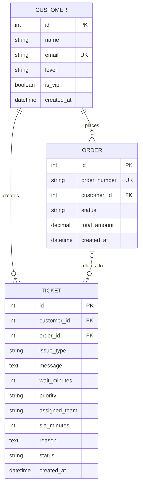

# ServiceMind 数据库 ER 图

ServiceMind 使用 PostgreSQL 保存客户、订单和客服工单，通过 SQLAlchemy ORM 管理实体关系。

## 实体关系图



## 关系说明

### 客户与订单

一个客户可以拥有零个或多个订单，每个订单必须属于一个客户。

```text
customers.id ← orders.customer_id
```

### 客户与工单

一个客户可以创建零个或多个工单，每个工单必须属于一个客户。

```text
customers.id ← tickets.customer_id
```

### 订单与工单

一个订单可以关联零个或多个工单。工单可以不关联订单，因此 `tickets.order_id` 允许为空。

```text
orders.id ← tickets.order_id
```

## 约束说明

| 表 | 字段 | 约束 | 用途 |
|---|---|---|---|
| `customers` | `id` | Primary Key | 客户唯一编号 |
| `customers` | `email` | Unique、Index | 防止客户邮箱重复 |
| `orders` | `id` | Primary Key | 订单唯一编号 |
| `orders` | `order_number` | Unique、Index | 防止订单号重复 |
| `orders` | `customer_id` | Foreign Key、Index | 关联客户 |
| `tickets` | `id` | Primary Key | 工单唯一编号 |
| `tickets` | `customer_id` | Foreign Key、Index | 关联客户 |
| `tickets` | `order_id` | Nullable Foreign Key、Index | 可选关联订单 |

## ORM 关系

SQLAlchemy 中配置了以下双向关系：

```text
Customer.orders  ↔ Order.customer
Customer.tickets ↔ Ticket.customer
Order.tickets    ↔ Ticket.order
```

客户删除时，其订单和工单使用 `delete-orphan` 级联处理。订单与工单通过外键保持引用关系。

## 查看真实数据库外键

```powershell
docker compose exec postgres psql `
    -U servicemind `
    -d servicemind `
    -c "\d customers"

docker compose exec postgres psql `
    -U servicemind `
    -d servicemind `
    -c "\d orders"

docker compose exec postgres psql `
    -U servicemind `
    -d servicemind `
    -c "\d tickets"
```